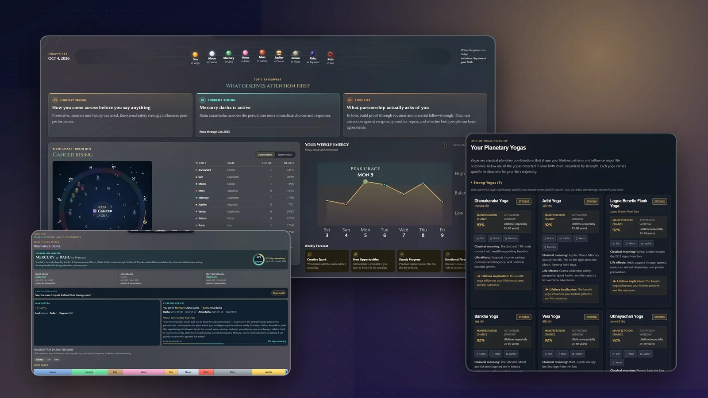

# Lagna Atelier

**Live:** [lagnaatelier.site](https://lagnaatelier.site)

A Vedic astrology engine on Next.js. It calculates birth charts across six ayanamshas and six house
systems, times life periods with Vimshottari dasha, detects yogas, reads palms from a photo, and turns
all of it into plain-language readings in seven languages.

<p align="center"></p>

**1,863 tests across 138 files** · **23 divisional charts** · **6 ayanamshas × 6 house systems** · **7 languages**

## What it does

- **Charts:** natal chart (North Indian wheel), divisional charts, houses, aspects, nakshatras, shadbala, ashtakavarga and panchanga, all computed server-side in API routes.
- **Timing:** Vimshottari dasha periods with a calculation audit, transits, annual charts (varshaphal) and muhurta.
- **Yogas:** planetary combinations detected and ranked by strength by a rules engine.
- **Palm reading:** on-device hand landmarks with MediaPipe, then a vision-model reading, with follow-up questions.
- **Compatibility:** synastry between two charts.
- **Readings:** dasha interpretations, life-area briefs and life-shift readings written by Claude, under per-route rate limits and a daily spend cap. Each panel falls back to built-in text when no key is set.

## Where data lives

Charts work signed out. Up to **5 profiles** per device live in the browser, each with its own chart
history, palm readings and intake drafts. Clearing site data erases them.

Signing in with Google adds an account. With your **explicit consent**, the charts you view are then
saved to it in Neon Postgres: the client, the consent record, the birth profile and the calculation.
Withdrawing consent from the settings on `/login` deletes the saved birth profiles and their
calculations; the local copies stay.

## Run it locally

```bash
npm install
npm run dev        # http://localhost:7001
npm test           # Vitest, run once
npm run test:watch
```

Charts need no environment variables. Copy `.env.example` to `.env.local` to turn on the rest:

| Variables | Unlocks |
|---|---|
| `ANTHROPIC_API_KEY` | Claude readings (dasha, life areas, life shifts, palm follow-ups); the primary provider for palm reading |
| `OPENAI_API_KEY` | Palm-reading fallback when Claude is unavailable or unset |
| `DATABASE_URL`, `DATABASE_URL_UNPOOLED`, `DEVICE_ID_SECRET`, `AUTH_GOOGLE_ID`, `AUTH_GOOGLE_SECRET`, `APP_ORIGIN` | Google sign-in and saved charts |

Without the sign-in group the button is hidden and nothing else changes. `.env.example` explains each
variable and where to get it. Both AI keys are spend-capped per UTC day in `lib/llm-budget.ts`.

If port 7001 is still held by an earlier run on Windows:

```powershell
Get-NetTCPConnection -LocalPort 7001 -ErrorAction SilentlyContinue |
  Select-Object -ExpandProperty OwningProcess -Unique |
  ForEach-Object { Stop-Process -Id $_ -Force }
```

## Stack

| | |
|---|---|
| App | Next.js 16 (App Router), React 19, TypeScript, Framer Motion |
| Astronomy | astronomy-engine, plus a Swiss Ephemeris engine path |
| Validation | Zod |
| AI | Claude (`@anthropic-ai/sdk`), OpenAI as palm-reading fallback, MediaPipe hand landmarks |
| Data | Browser localStorage; Neon Postgres + Drizzle ORM for accounts and consented charts |
| Auth | Google OAuth, signed device-id cookie |
| Tests | Vitest |

## Deploy

**Vercel:** import the repo and set any of the keys above in the project settings. Node 20+ comes
from `engines` in `package.json`.

**Any Node host:** build with `npm install && npm run build`, start with `npm start`, Node 20.x.

## Docs

| | |
|---|---|
| [`docs/account-data-sync-plan.md`](docs/account-data-sync-plan.md) | How local profiles and account sync fit together |
| [`docs/calculation-accuracy-roadmap.md`](docs/calculation-accuracy-roadmap.md) | Calculation accuracy and reading-relevance roadmap |
| [`docs/ultimate-module-and-yoga-rules.md`](docs/ultimate-module-and-yoga-rules.md) | The yoga rules engine |
| [`docs/pyjhora-yoga-comparison.md`](docs/pyjhora-yoga-comparison.md) | Yoga detection checked against PyJHora |
